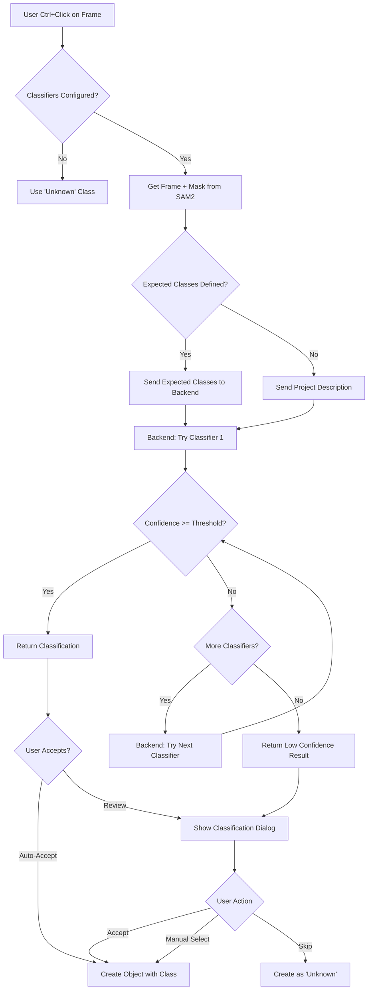

# Auto-Classification Architecture

## Overview

This document outlines the architecture for automatic object classification in the video annotation tool. The system uses an ensemble of AI models with sequential fallback, context awareness, and user control.

## Backend API Design

### 1. Get Available Classifiers

```
GET /api/ai/classifiers/available

Response:
{
  "classifiers": [
    {
      "id": "dino",
      "name": "GroundingDINO",
      "type": "object_detection",
      "capabilities": ["bbox", "confidence", "multi_object"],
      "default_confidence_threshold": 0.3,
      "available": true
    },
    {
      "id": "llm_vision",
      "name": "GPT-4 Vision / Claude Vision",
      "type": "vision_language_model",
      "capabilities": ["contextual", "reasoning", "custom_prompts"],
      "default_confidence_threshold": 0.7,
      "available": true
    },
    {
      "id": "clip",
      "name": "CLIP Classifier",
      "type": "zero_shot_classification",
      "capabilities": ["text_prompts", "zero_shot"],
      "default_confidence_threshold": 0.5,
      "available": false
    }
  ]
}
```

### 2. Classify Object

```
POST /api/ai/classify

Request:
{
  "video_id": "uuid",
  "frame_number": 1968,
  "bbox": [x1, y1, x2, y2],  // Optional - crop to this region
  "mask_base64": "...",       // Optional - use segmentation mask
  "context": {
    "project_description": "Windsurfing competition footage",
    "expected_classes": ["Sail", "Board", "Person", "Buoy"],
    "classifier_chain": ["dino", "llm_vision"],
    "min_confidence": 0.6
  }
}

Response:
{
  "success": true,
  "classification": {
    "class_name": "Sail",
    "confidence": 0.87,
    "classifier_used": "dino",
    "alternatives": [
      {"class_name": "Windsurfing Sail", "confidence": 0.82, "source": "llm_vision"}
    ]
  },
  "fallback_chain": [
    {"classifier": "dino", "result": "success", "confidence": 0.87},
    {"classifier": "llm_vision", "result": "skipped", "reason": "previous_success"}
  ]
}
```

## Frontend Workflow



## UI Components Needed

### 1. Project Settings Panel (New Component)

**Location**: Accessible from top toolbar or settings menu

**Features**:
- **Classifier Configuration**:
  - Drag-to-reorder list of available classifiers
  - Toggle enable/disable for each classifier
  - Set minimum confidence threshold per classifier
  - Set global minimum confidence threshold

- **Project Context**:
  - Text area for project description
  - Example: "This dataset contains windsurfing competition footage. Objects include sails, boards, people, and buoys."

- **Expected Classes Integration**:
  - Shows list of classes from ClassManager
  - Checkbox per class: "Expected in this project"
  - When checked, these classes are sent to classifiers as hints

**Mock UI**:
```
┌─────────────────────────────────────────┐
│ Classification Settings                  │
├─────────────────────────────────────────┤
│ Project Description:                     │
│ ┌─────────────────────────────────────┐ │
│ │ Windsurfing competition with sails, │ │
│ │ boards, and people                  │ │
│ └─────────────────────────────────────┘ │
│                                          │
│ Classifier Chain:                        │
│ ☑ 1. GroundingDINO     [↕] Min: 0.6    │
│ ☑ 2. GPT-4 Vision      [↕] Min: 0.5    │
│ ☐ 3. CLIP (unavailable)                 │
│                                          │
│ Expected Classes:                        │
│ ☑ Sail                                  │
│ ☑ Board                                 │
│ ☑ Person                                │
│ ☐ Buoy                                  │
│ ☐ Background                            │
└─────────────────────────────────────────┘
```

### 2. Classification Dialog (New Component)

**Triggered When**:
- Classification confidence < threshold
- User enables "Review all classifications"
- Multiple alternatives with similar confidence

**Features**:
- Show classified frame region with mask overlay
- Display top 3 classification results with confidence bars
- Quick action buttons
- Manual class selector dropdown

**Mock UI**:
```
┌─────────────────────────────────────────┐
│ Classify Object                      [×] │
├─────────────────────────────────────────┤
│                                          │
│  [Frame Preview with Mask Highlight]    │
│                                          │
│ Suggested Classifications:               │
│ ● Sail            ████████░░ 87%        │
│ ○ Windsurfing Sail ██████░░░░ 65%      │
│ ○ Kite            ████░░░░░░ 45%       │
│                                          │
│ Or select manually:                      │
│ [Dropdown: All Classes          ▼]      │
│                                          │
│ [ Accept "Sail" ] [ Manual ] [ Skip ]   │
└─────────────────────────────────────────┘
```

### 3. ClassManager Enhancement

**Add to existing ClassManager**:
- Checkbox column: "Expected in Project"
- Tooltip: "Hint to classifiers to prefer these classes"
- Persist expected classes in project state/localStorage

## Implementation Phases

### Phase 1: Backend Foundation
**Goal**: Classifier discovery and basic classification API

**Tasks**:
1. Create `/api/ai/classifiers/available` endpoint
   - Return list of available models
   - Include capabilities and default thresholds

2. Create `/api/ai/classify` endpoint
   - Implement DINO integration first (already exists)
   - Add ensemble logic for trying multiple classifiers
   - Return confidence scores and alternatives

3. Add classifier configuration storage
   - Store in video metadata or project settings
   - Include classifier order, thresholds, context

**Files to Create/Modify**:
- Backend: `/api/ai/classifiers/available`
- Backend: `/api/ai/classify`
- Backend: Ensemble logic module

### Phase 2: Frontend Integration
**Goal**: Basic auto-classification on Ctrl+click

**Tasks**:
1. Create `src/lib/classificationApi.ts`
   - `getAvailableClassifiers()`
   - `classifyObject(videoId, frameNumber, bbox, mask, context)`

2. Modify `src/pages/Index.tsx` (handleCanvasClick)
   - Remove hardcoded "Sail" class
   - Call classification API after SAM2 result
   - Handle classification response

3. Create `src/components/ClassificationDialog.tsx`
   - Show classification results
   - Allow user to accept/reject/manual select
   - Handle low-confidence scenarios

**Files to Create/Modify**:
- `src/lib/classificationApi.ts` (new)
- `src/pages/Index.tsx` (modify handleCanvasClick)
- `src/components/ClassificationDialog.tsx` (new)

### Phase 3: User Experience
**Goal**: Project settings and classifier configuration

**Tasks**:
1. Create `src/components/ProjectSettings.tsx`
   - Classifier ordering UI
   - Confidence threshold sliders
   - Project description text area

2. Enhance `src/components/ClassManager.tsx`
   - Add "Expected in Project" checkbox column
   - Persist expected classes
   - Send to classification API as context

3. Add classification settings to app state
   - Store in localStorage or project metadata
   - Include: classifier order, thresholds, description, expected classes

**Files to Create/Modify**:
- `src/components/ProjectSettings.tsx` (new)
- `src/components/ClassManager.tsx` (enhance)
- `src/types/annotation.ts` (add types)

### Phase 4: Advanced Features
**Goal**: Multi-model support and learning from corrections

**Tasks**:
1. Add LLM vision classifier (GPT-4V / Claude)
   - Integrate with backend `/api/ai/classify`
   - Use project description as context
   - Support custom prompts

2. Add CLIP zero-shot classifier
   - Text-based class matching
   - Good for custom/unusual classes

3. User feedback loop
   - Track when users override classifications
   - Log corrections for model improvement
   - Show classification accuracy stats

4. Batch classification
   - Classify all unclassified objects in video
   - Progress indicator
   - Review queue for low-confidence results

**Files to Create/Modify**:
- Backend: Add LLM vision classifier
- Backend: Add CLIP classifier
- `src/components/BatchClassification.tsx` (new)
- `src/components/ClassificationStats.tsx` (new)

## Key Design Decisions

### 1. Ensemble Strategy
- **Sequential Fallback**: Try classifiers in order until confidence threshold met
- **Alternative Tracking**: Keep top N results from each classifier
- **User Override**: Always allow manual selection

### 2. Context Awareness
- **Project Description**: Free-form text describing dataset
- **Expected Classes**: Hint to prefer certain classes
- **Frame Context**: Use surrounding frames for temporal consistency (future)

### 3. User Control
- **Confidence Thresholds**: Per-classifier and global minimums
- **Classifier Ordering**: User-defined priority
- **Review Mode**: Option to review all classifications before accepting

### 4. Fallback Behavior
- If all classifiers fail or are unavailable → Use "Unknown" class
- If user disables all classifiers → Use "Unknown" class
- If classification errors → Show error toast, create as "Unknown"

## Example User Workflows

### Workflow 1: Windsurfing Dataset Setup
1. User opens project settings
2. Adds project description: "Windsurfing competition footage"
3. Creates classes: Sail, Board, Person, Buoy
4. Marks all as "Expected in Project"
5. Enables DINO and GPT-4 Vision classifiers
6. Sets DINO threshold to 0.6, GPT-4V to 0.5
7. Ctrl+clicks on sail → DINO returns "Sail" at 0.87 confidence → Auto-accepted
8. Ctrl+clicks on unusual object → DINO returns 0.4 → Falls back to GPT-4V → Returns "Buoy" at 0.71 → Dialog shown → User accepts

### Workflow 2: Wildlife Dataset
1. User opens project with 50+ animal classes defined
2. Enables GPT-4 Vision only (better for diverse animals)
3. Sets project description: "African savanna wildlife"
4. Marks common animals as expected: Lion, Elephant, Zebra, Giraffe
5. Ctrl+clicks on animal → GPT-4V uses expected classes as hints → Returns "Zebra" at 0.82 → Auto-accepted
6. Encounters rare animal → GPT-4V returns "Antelope (uncertain)" at 0.45 → Dialog shown with alternatives → User manually selects "Impala"

### Workflow 3: Industrial Defect Detection
1. User has small dataset with specific defect types
2. Enables CLIP for zero-shot classification
3. Creates classes: Scratch, Dent, Discoloration, Crack
4. All marked as expected
5. Ctrl+clicks on defect → CLIP matches against class names → Returns "Crack" at 0.68 → Auto-accepted
6. No need for extensive training data

## Future Enhancements

### 1. Temporal Consistency
- Use previous/next frames to validate classifications
- Track objects across frames to maintain consistent labels
- Flag sudden class changes for review

### 2. Active Learning
- Suggest frames/objects most valuable to label
- Prioritize uncertain classifications for user review
- Improve model based on user corrections

### 3. Custom Model Fine-tuning
- Allow users to fine-tune models on their dataset
- Export labeled data for external training
- Import custom model weights

### 4. Classification Confidence Visualization
- Heatmap showing classifier confidence across frames
- Timeline view of classification certainty
- Identify problematic regions needing review

## Technical Considerations

### Performance
- Cache classifier results per frame
- Pre-compute classifications in background
- Lazy-load classifier models on backend

### Error Handling
- Graceful degradation if classifiers unavailable
- Timeout handling for slow models
- Retry logic for network failures

### Storage
- Store classification metadata with annotations
- Track which classifier was used
- Keep alternatives for later review

### Privacy
- Project descriptions stay on server
- Frame data sent to classifiers only when needed
- Option to use only local/on-prem models

---

**Document Status**: Draft  
**Last Updated**: 2025-10-04  
**Version**: 1.0
